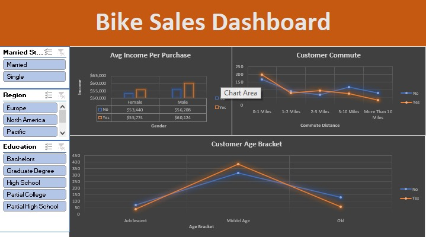

# 📊 Excel Project – Sales Dashboard

## 📌 Description
This project showcases a sales data analysis using Microsoft Excel. The data was cleaned and visualized using Pivot Tables, Slicers, and Charts to build an interactive dashboard that helps explore sales by region, product category, and discount level.

## 🛠️ Tools Used
- Microsoft Excel
- Pivot Tables
- Slicers
- Bar Charts
- Conditional Formatting
- Data Cleaning

## 📸 Dashboard Preview

## 🔍 Key Insights
- Top performing regions and categories
- Sales distribution across countries
- Filtering with dynamic slicers

## 📁 Files
- `Excel Project Dataset.xlsx`: The cleaned data and final dashboard
- `dashboard-preview.png`: Screenshot of the dashboard
